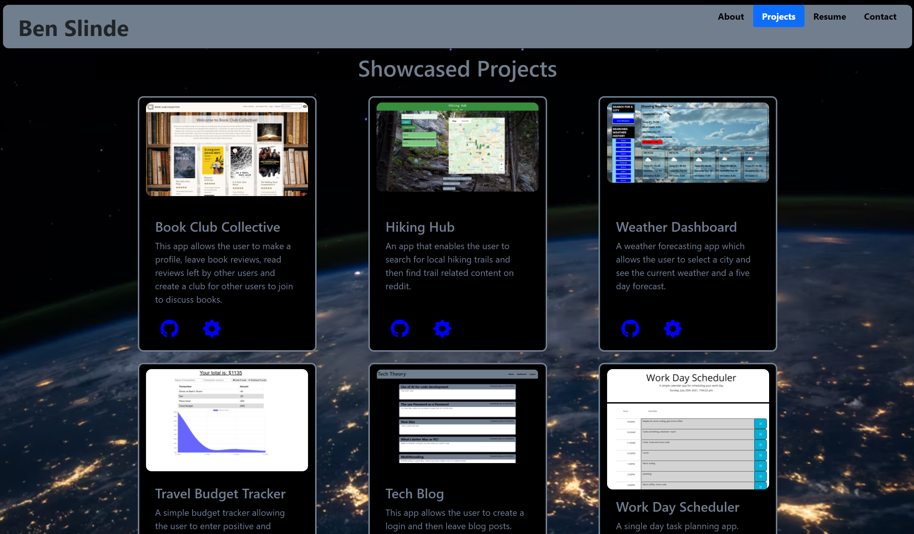

# Software Engineering Portfolio of Ben Slinde
## 
This portfolio contains a collection of projects I have developed so far as part of a Full Stack Coding Bootcamp at Georgia Tech.  Each of the projects details contains a link to the github repo and the deployed application.

## Technologies and Skills Demonstrated

* The portfolio was compiled with React
* Individual projects detail skills used for each

## Visit my Portfolio

https://github.com/stevenslade/portfolio-react

## Screenshot

